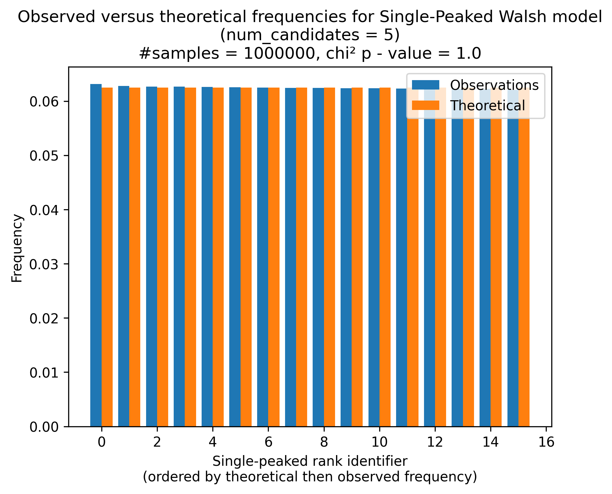
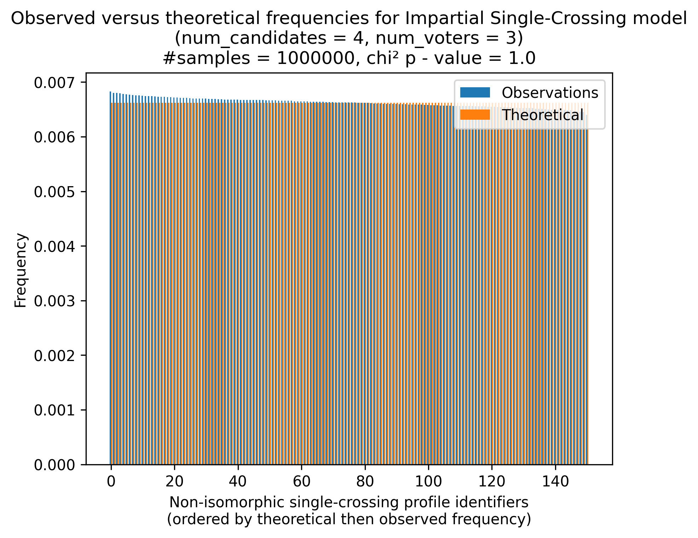

.. _validation:

Validation
==========

In order to ensure the correctness of the samplers we provide in this package,
we implemented different tests. First we implemented typical Python tests to make sure
that the developed features are correct from a programming perspective. But more
importantly, we also implemented statistical tests to ensure that the samplers
actually sample what we want. We present these validations below.

Procedure
---------

To validate each sampler, we ran chi-squared tests to compare the distribution of the
samples it is generating to the theoretical distribution of these samples. We also
display this information in a graph to assess (non-scientifically) the adequation.

Ordinal Samplers
----------------

Impartial
~~~~~~~~~

.. image:: validation_plots/ordinal/ordinal_impartial.png
  :width: 500
  :alt: Observed versus theoretical frequencies for the impartial culture

Impartial Anonymous
~~~~~~~~~~~~~~~~~~~

.. image:: validation_plots/ordinal/ordinal_impartial_anonymous.png
  :width: 500
  :alt: Observed versus theoretical frequencies for the impartial anonymous culture

Stratification
~~~~~~~~~~~~~~

.. image:: validation_plots/ordinal/stratification_0.png
  :width: 500
  :alt: Observed versus theoretical frequencies for the stratification culture with weight=0

.. image:: validation_plots/ordinal/stratification_0.2.png
  :width: 500
  :alt: Observed versus theoretical frequencies for the stratification culture with weight=0.2

.. image:: validation_plots/ordinal/stratification_0.6.png
  :width: 500
  :alt: Observed versus theoretical frequencies for the stratification culture with weight=0.6

.. image:: validation_plots/ordinal/stratification_1.png
  :width: 500
  :alt: Observed versus theoretical frequencies for the stratification culture with weight=1

Urn
~~~

.. image:: validation_plots/ordinal/urn_0.png
  :width: 500
  :alt: Observed versus theoretical frequencies for Mallow's model with alpha=0

.. image:: validation_plots/ordinal/urn_0.041666666666666664.png
  :width: 500
  :alt: Observed versus theoretical frequencies for Mallow's model with alpha=0

.. image:: validation_plots/ordinal/urn_0.5.png
  :width: 500
  :alt: Observed versus theoretical frequencies for Mallow's model with alpha=0

.. image:: validation_plots/ordinal/urn_1.png
  :width: 500
  :alt: Observed versus theoretical frequencies for Mallow's model with alpha=0

Mallows
~~~~~~~

.. image:: validation_plots/ordinal/mallows_0.1.png
  :width: 500
  :alt: Observed versus theoretical frequencies for Mallow's model with phi=0.1

.. image:: validation_plots/ordinal/mallows_0.5.png
  :width: 500
  :alt: Observed versus theoretical frequencies for Mallow's model with phi=0.5

.. image:: validation_plots/ordinal/mallows_0.8.png
  :width: 500
  :alt: Observed versus theoretical frequencies for Mallow's model with phi=0.8

.. image:: validation_plots/ordinal/mallows_1.png
  :width: 500
  :alt: Observed versus theoretical frequencies for Mallow's model with phi=1

Plackett-Luce
~~~~~~~~~~~~~

.. image:: validation_plots/ordinal/plackett_luce_0.png
  :width: 500
  :alt: Observed versus theoretical frequencies for the Plackette-Luce model

.. image:: validation_plots/ordinal/plackett_luce_1.png
  :width: 500
  :alt: Observed versus theoretical frequencies for the Plackette-Luce model

.. image:: validation_plots/ordinal/plackett_luce_2.png
  :width: 500
  :alt: Observed versus theoretical frequencies for the Plackette-Luce model

Single-Peaked
~~~~~~~~~~~~~

.. image:: validation_plots/ordinal/sp_circle.png
  :width: 500
  :alt: Observed versus theoretical frequencies for the single-peaked on a circle culture

Single-Crossing
~~~~~~~~~~~~~~~

.. image:: validation_plots/ordinal/single_crossing.png
  :width: 500
  :alt: Observed versus theoretical frequencies for the impartial single-crossing culture

