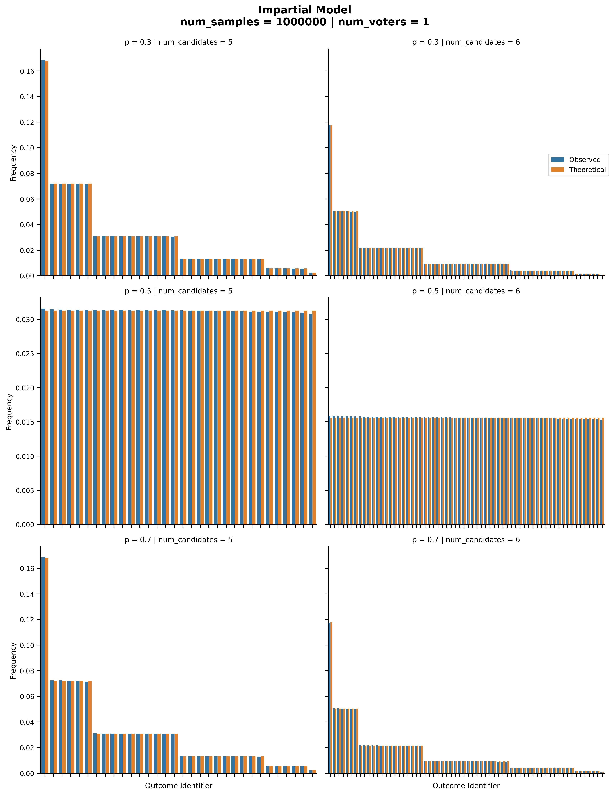
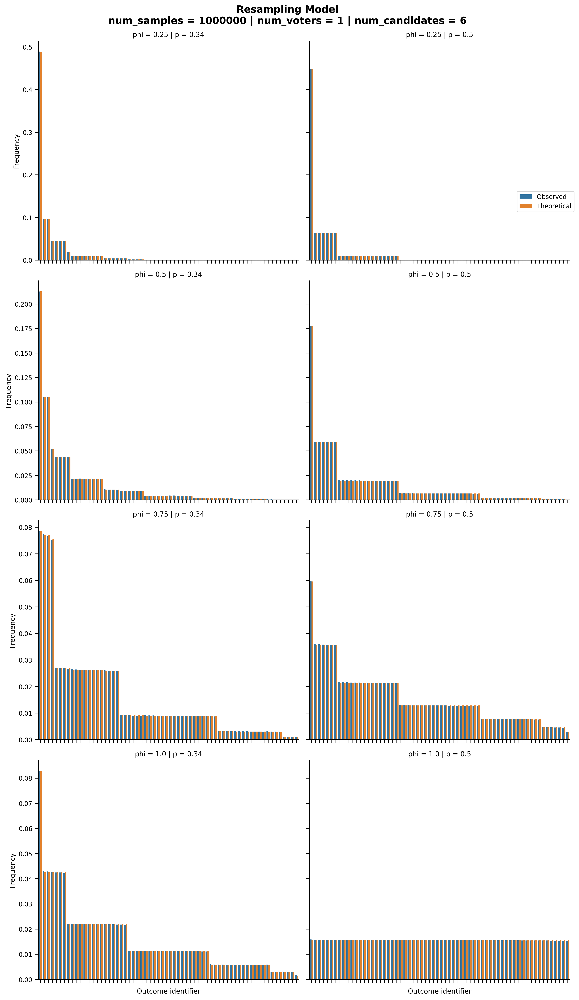
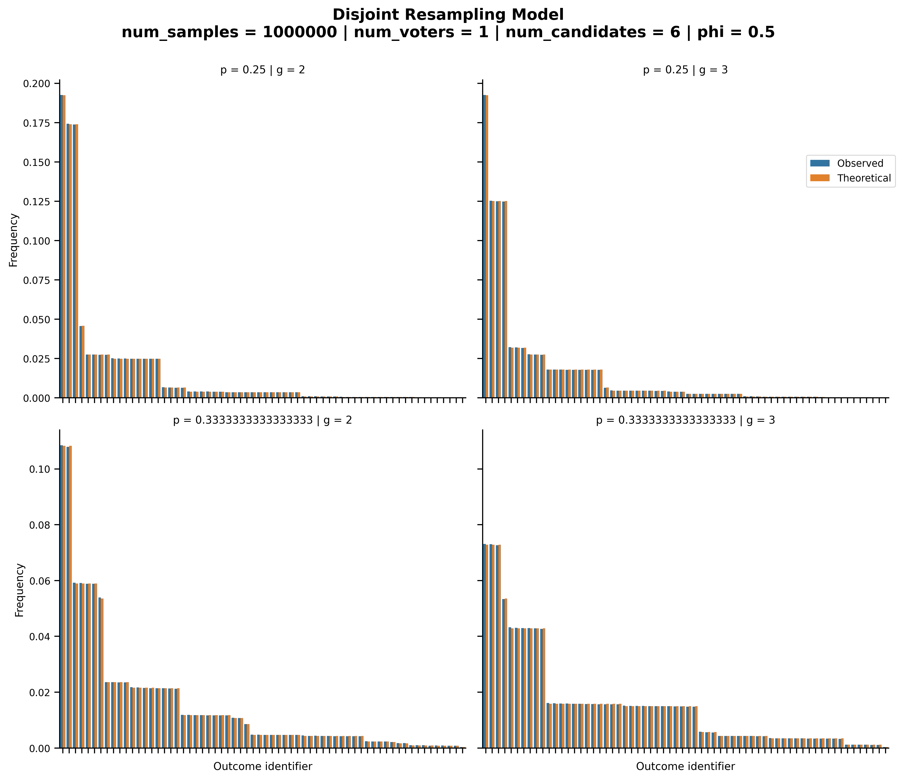
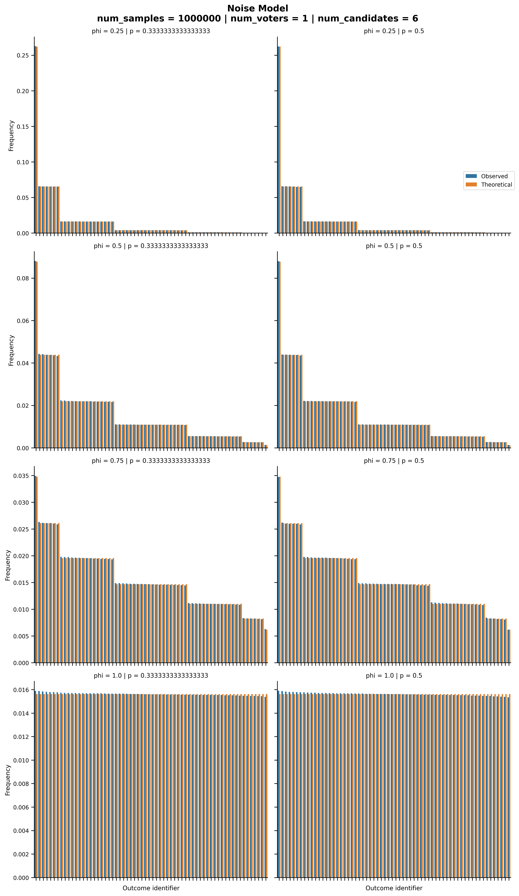
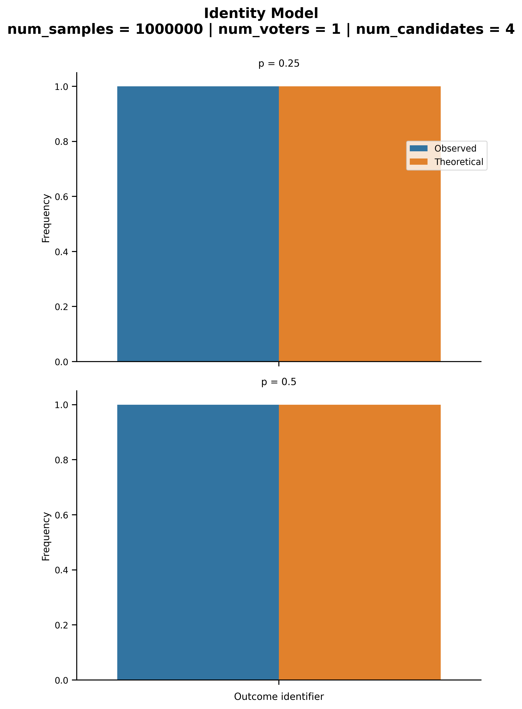

Approval Samplers
=================

We present below the validation tests we ran for approval samplers.

Impartial
---------

:py:func:`prefsampling.approval.impartial`

The probability distribution generated by the approval impartial culture model.

Resampling
----------

:py:func:`prefsampling.approval.resampling`

The probability distribution generated by the resampling model.
See the work of `Szufa et al. (2022) <https://www.ijcai.org/proceedings/2022/0071.pdf>`_
for more details.

Disjoint Resampling
----------

:py:func:`prefsampling.approval.disjoint_resampling`

The probability distribution generated by the disjoint resampling model.
See  the work of `Szufa et al. (2022) <https://www.ijcai.org/proceedings/2022/0071.pdf>`_
for more details.

Noise
----------

:py:func:`prefsampling.approval.noise`

The probability distribution generated by the noise model based on the Hamming distance.

Identity
----------

:py:func:`prefsampling.approval.identity`

The probability distribution generated by the identity model.

