Ordinal Samplers
================

We present below the validation tests we ran for ordinal samplers.

Impartial
---------

:py:func:`prefsampling.ordinal.impartial`

Under the impartial model, all ranks are equally likely to be generated.

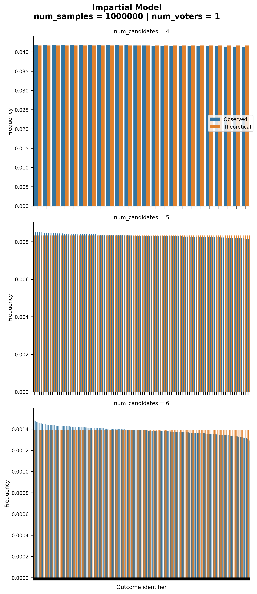

Impartial Anonymous
-------------------

:py:func:`prefsampling.ordinal.impartial_anonymous`

With the impartial anonymous culture, every multisets of votes--an anonymous profile---are
equally likely to be generated. Note here that we are discussing anonymous profiles and
not ranks.

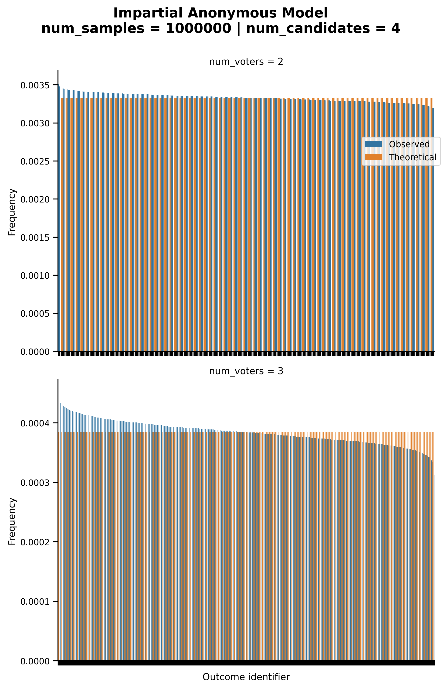

Stratification
--------------

:py:func:`prefsampling.ordinal.stratification`

Under the stratification model, only the ranks that are ''stratified'' can occur.

When the weight is 0 or 1, there is a single class, and thus, we fall back to the
impartial culture.

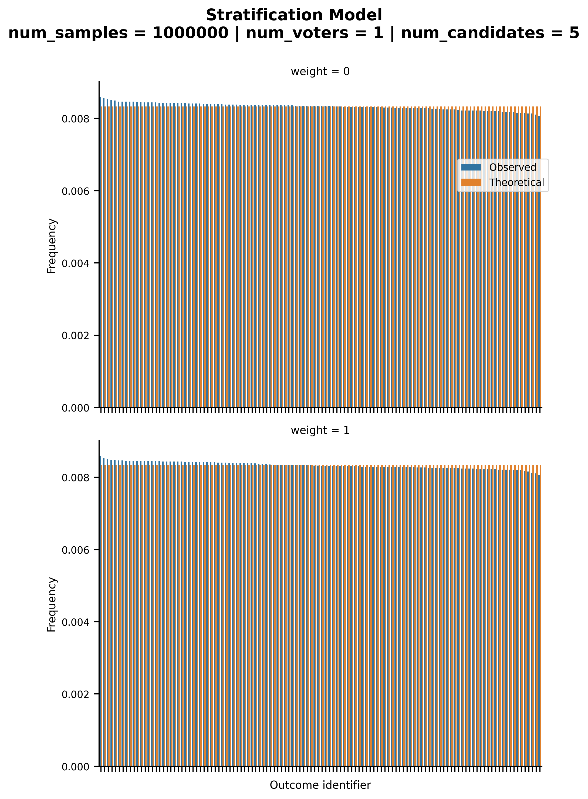

We the weight is different from 0 and 1, we obtain more interesting distributions over
the ranks.

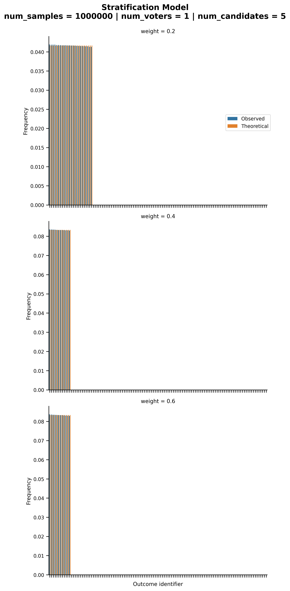

Mallows
-------

:py:func:`prefsampling.ordinal.mallows`

The probability distribution generated by a Mallows' model is also well known.
See https://jmlr.org/papers/v15/lu14a.html for instance. When `phi` is one,
we fall back to the impartial culture.

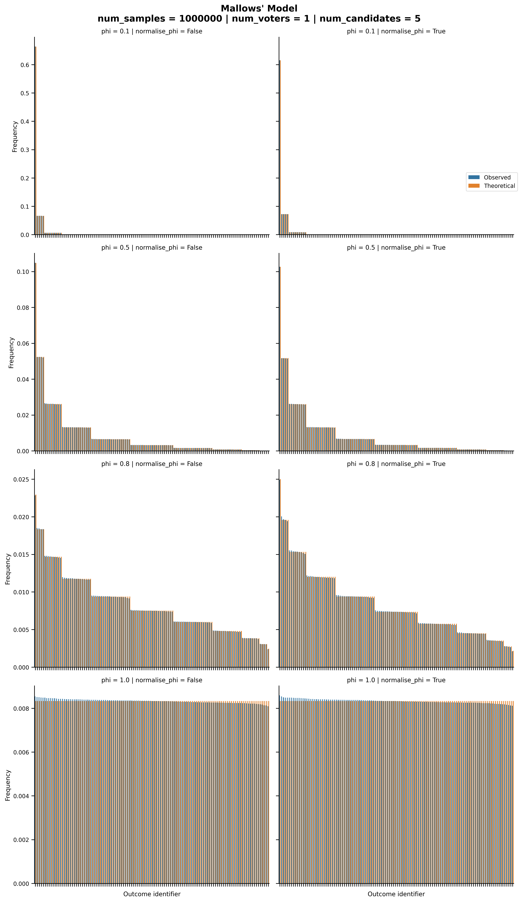

Plackett-Luce
-------------

:py:func:`prefsampling.ordinal.plackett_luce`

The properties of the Plackett-Luce model have also been described at length.
See https://proceedings.mlr.press/v48/zhaob16.html for example.

When all candidates have the same quality (i.e., all `alpha` values are equal),
we fall back to the impartial culture case. Otherwise, different distribution
can be observed.

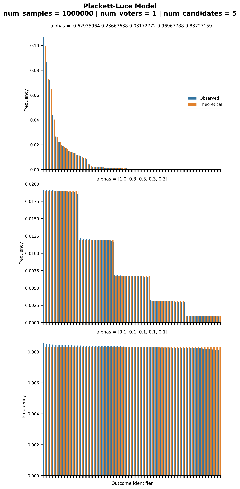

Didi
----

:py:func:`prefsampling.ordinal.didi`

For the didi model, there is no know probability distribution over the outcomes.

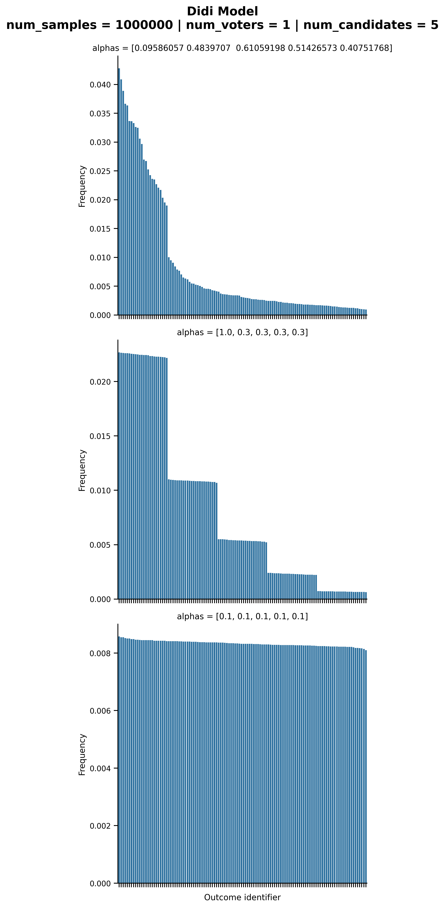

Euclidean
---------

:py:func:`prefsampling.ordinal.euclidean`

In the case of the Euclidean model, little is known about the distribution over
ranks that they generate.

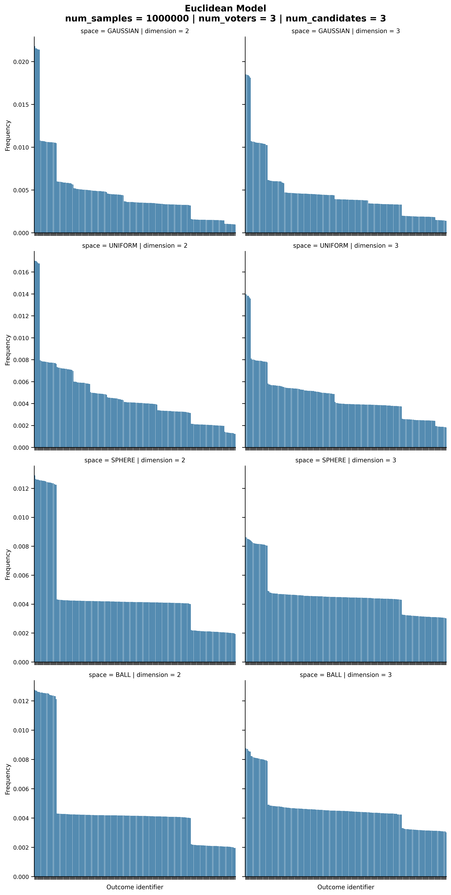

When there a single voter, we fall back to the impartial culture case.

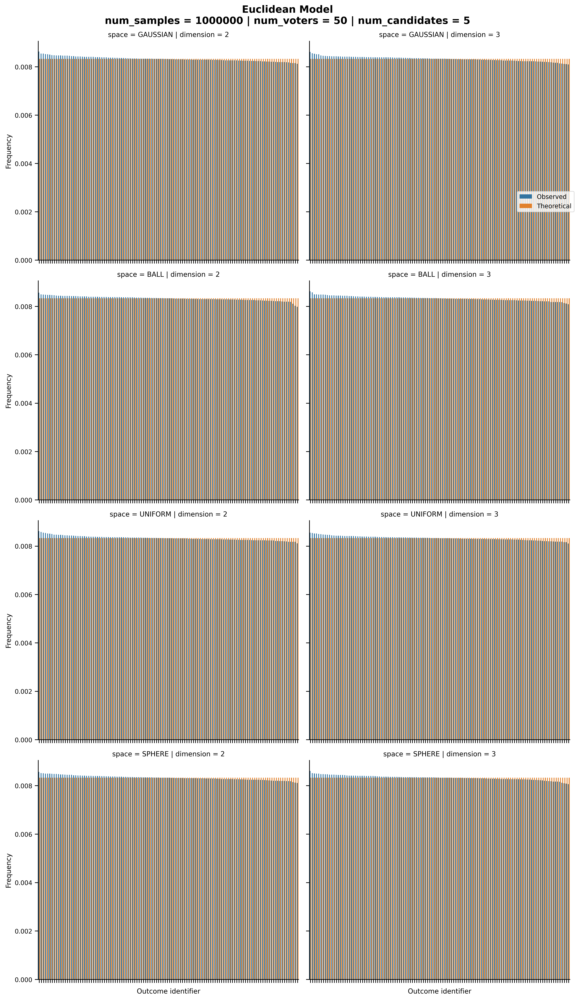

Single-Peaked
-------------

:py:func:`prefsampling.ordinal.single_peaked_walsh`

For single-peaked samplers, the one proposed by
`Walsh (2015) <https://arxiv.org/abs/1503.02766>`_ ensures that all single-peaked
rank are equally likely to be generated.

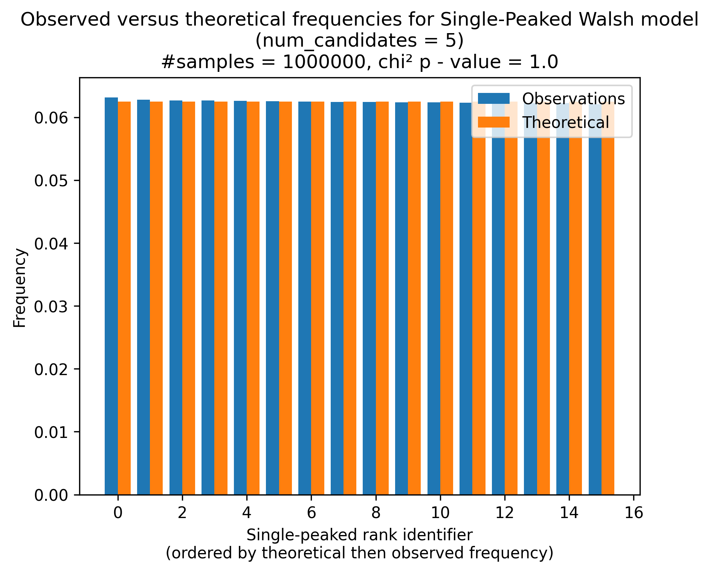

:py:func:`prefsampling.ordinal.single_peaked_conitzer`

The model proposed by `Conitzer (2009) <https://arxiv.org/abs/1401.3449>`_ yields
a different probability distribution. In this distribution, the probability of observing
a given single-peaked rank is equal to  `1/m * (1/2)**dist_peak_to_end` where `m` is the
number of candidates and `dist_peak_to_end` is the minimum distance from to peak
to an end of the axis (i.e., candidates `0` or `m - 1`).

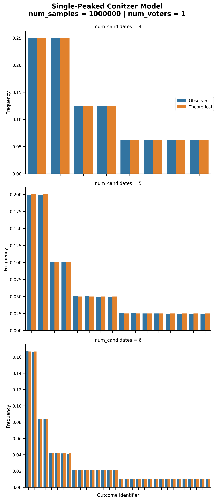

:py:func:`prefsampling.ordinal.single_peaked_circle`

For the single-peaked on a circle model, all single-peaked on a circle rank are
equally likely to be generated.

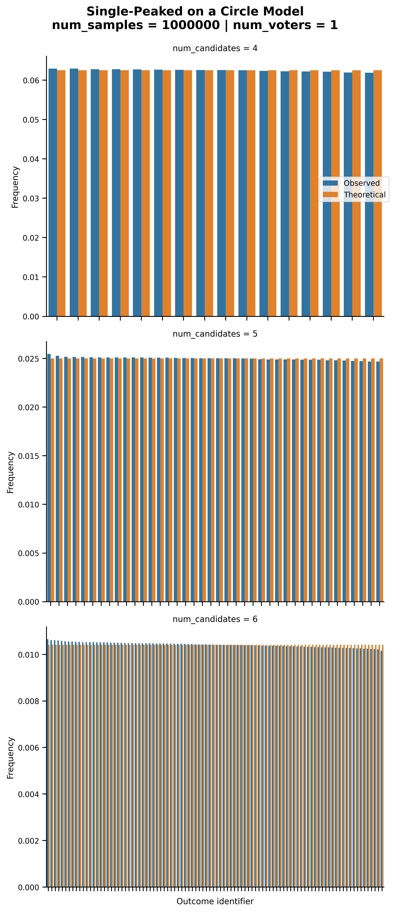

Single-Crossing
---------------

:py:func:`prefsampling.ordinal.single_crossing`

For the single-crossing samplers, the impartial is designed to yield a uniform probability
distribution over all non-isomorphic single-crossing profiles.

.. image:: validation_plots/ordinal/single_crossing_impartial.png
  :width: 800
  :alt: Observed versus theoretical frequencies for the single-crossing culture

The efficient sampler has unknown probability distribution.

.. image:: validation_plots/ordinal/single_crossing_impartial.png
  :width: 800
  :alt: Observed versus theoretical frequencies for the single-crossing culture

Group-Separable
---------------

:py:func:`prefsampling.ordinal.group_separable`

The sampler is supposed to produce a uniform distribution when used with a tree sampler
that yields a uniform distribution. This does not appear to be the case however.

.. image:: validation_plots/ordinal/group_separable.png
  :width: 800
  :alt: Observed versus theoretical frequencies for the group separable culture
