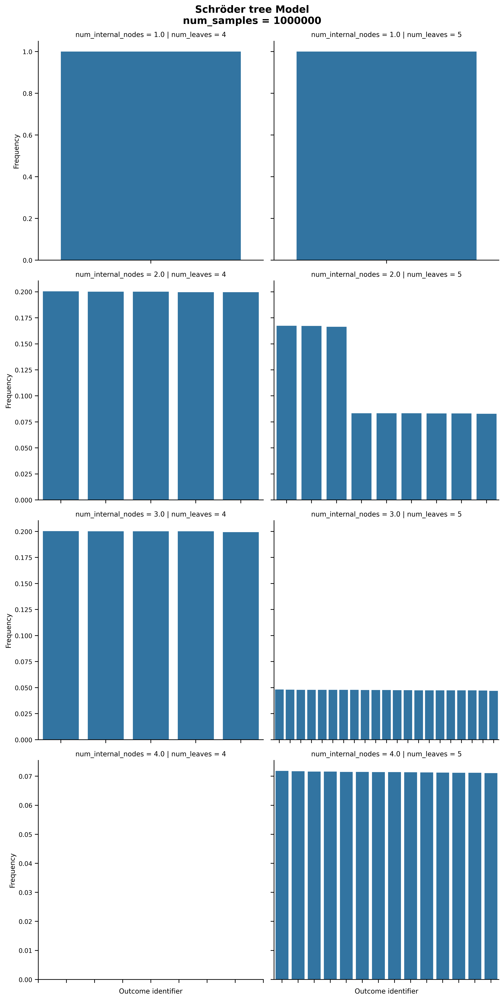
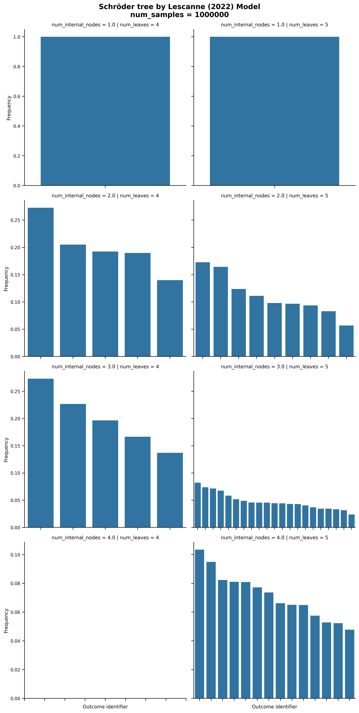
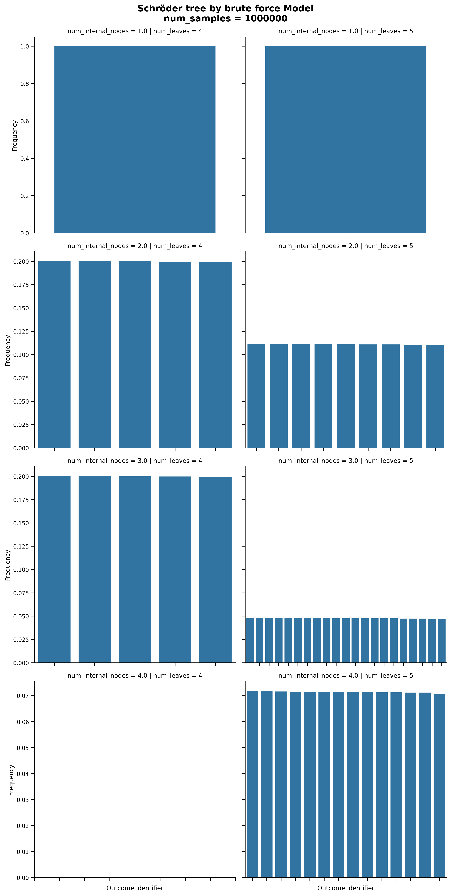

Tree Samplers
=============

We present below the validation tests we ran for samplers that produce trees.

Schröder Trees by Alonso, Rémy, Schott (1997)
---------------------------------------------

:py:func:`prefsampling.tree.schroeder_tree`

This sampler is supposed to yield a uniform distribution, but does not in practice.

Schröder Trees by Lescanne (2022)
---------------------------------

:py:func:`prefsampling.tree.schroeder_tree_lescanne`

This sampler has unknown probability distribution but is efficient for large numbers of leaves.

Uniform Schröder Trees
----------------------

:py:func:`prefsampling.tree.schroeder_tree_brute_force`

This sampler yields a uniform probability distribution but enumerates all trees (and is thus slow).

